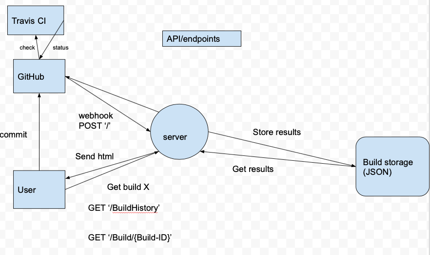

# dd2480-g18-Continuous-Integration
The following project is an implementation of a small scale continous integration CI server. The CI server is built upon the skeleton code of another project called [smallest-java-ci](https://github.com/KTH-DD2480/smallest-java-ci). The CI-server implements the core features of a CI-server which means that for each push the CI-server will compile and test the code and then set the commit status on github. 
The CI-server also allows users to browse previous builds.

An overview of how the CI-server works can be viewed below.



# Motivation 
The goal of the project is master the core of continous integration by implementing the core features of a CI-server. The secondary purpose of theis project is learning how to collaborate effectively when developing software. This includes issue tracking, task management, pull requests, code reviews and version control.  

# Tech Stack 
Main programming language of this project is **Java** and the following technologies are used in this project, 
* Maven 
* JUnit v.5.4 
* JETTY v.7.0.2
* javax v.4.0.1
* GSON v.2.8.5
* ngrok
* bash scripts

# Installation
Following section describes how to set up the development environment. 

## Setting up Maven
The easiest way to compile, test, and run the code in `src/` is to use Maven. Before using it, it must be set up once per computer.
1. Install Maven locally as described by [the official documentation](https://maven.apache.org/install.html).
2. Make sure to add the `bin` directory of Maven to your `PATH` environment variable (as described in the guide).
3. Check the environment variable value of `JAVA_HOME` and set it if necessary. 
4. At the root of the repository, open a command line prompt/terminal and run `mvn install`. This will download the necessary files to run unit tests etc.

## Compiling, Testing, and Running
Maven works with something called "lifecycle phases", which practically just works as commands that can be run in sequence. To run these commands, open a command line prompt/terminal at the root of the repository and run `mvn <lifecycle phase>`. The phases that are useful for this code is `clean`, `compile`, and `test`. `clean` will delete previously compiled and cached files. `compile` will compile the code located in `src/`. `test` will run the JUnit tests located in `src/test/`. These can be run in sequence, which is what [Travis CI](https://docs.travis-ci.com/) will run whenever a new commit is pushed to the GitHub repository, as shown below.

`mvn clean compile test`

## Setting up the server and routing traffic through ngrok

We then download the required dependencies:
```
JETTY_VERSION=7.0.2.v20100331
wget -U none https://repo1.maven.org/maven2/org/eclipse/jetty/aggregate/jetty-all/$JETTY_VERSION/jetty-all-$JETTY_VERSION.jar
wget -U none https://repo1.maven.org/maven2/javax/servlet/servlet-api/2.5/servlet-api-2.5.jar
#For linux users: 
curl -LO --tlsv1 https://bin.equinox.io/c/4VmDzA7iaHb/ngrok-stable-linux-amd64.zip
unzip ngrok-stable-linux-amd64.zip 
#For Mac user:
curl -LO --tlsv1 https://bin.equinox.io/c/4VmDzA7iaHb/ngrok-stable-darwin-386.zip
unzip ngrok-stable-darwin-386.zip
```

We compile the skeleton the continuous integration server:
```
javac -cp servlet-api-2.5.jar:jetty-all-$JETTY_VERSION.jar ContinuousIntegrationServer.java
```

We run the server on the machine, and we may make it visible on the Internet thanks to [Ngrok](https://ngrok.com/):
```
# open a first terminal window
JETTY_VERSION=7.0.2.v20100331
java -cp .:servlet-api-2.5.jar:jetty-all-$JETTY_VERSION.jar ContinuousIntegrationServer

# open a second terminal window
# this gives you the public URL of your CI server to set in Github
# copy-paste the forwarding URL "Forwarding                    http://8929b010.ngrok.io -> localhost:8080"
# note that this url is short-lived, and is reset everytime you run ngrok
./ngrok http 8080

```

We configure our Github repository:

* go to `Settings >> Webhooks`, click on `Add webhook`.
* paste the forwarding URL (eg `http://8929b010.ngrok.io`) in field `Payload URL`) and send click on `Add webhook`. In the simplest setting, nothing more is required.

We test that everything works:

* go to <http://localhost:8080> tp check that the CI server is running locally
* go to your Ngrok forwarding URL (eg <http://8929b010.ngrok.io>) to check that the CI server is visible from the internet, hence visible from Github
* make a commit in your repository
* observe the result, in two ways:
  * locally: in the console of your first terminal window, observe the requested URL printed on the console
  * on github: go to `Settings >> Webhooks` in your repo, click on your newly created webhook, scroll down to "Recent Deliveries", click on the last delivery and the on the `Response tab`, you'll see the output of your server `CI job done`
  * on ngrok: raise the terminal window with Ngrok, and you'll also the see URLs requested by Github

# Credits 
We would like to thank the teachers and TAs of the course DD2480 - Software Engineering Fundamentals for answering questions and clarifying any ambiguities regarding the assignment. 


# List of Contributions
